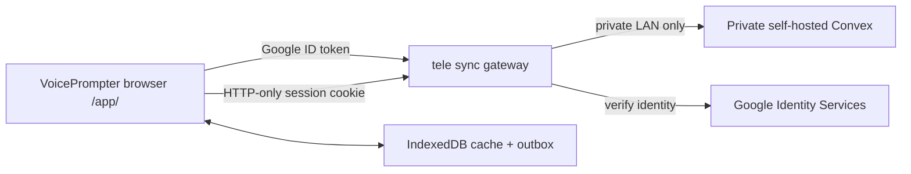

# Technical Plan: VoicePrompter Web App Upgrade

**Spec:** [`docs/specs/teleprompter-upgrade.md`](../docs/specs/teleprompter-upgrade.md)  
**Status:** Draft — awaiting plan approval before implementation  
**Decision:** Google sign-in only; an authenticated personal library; the Convex backend remains private.

## Architecture

### Trust boundaries

- The browser receives only its own library records, held locally in IndexedDB for offline continuity.
- Google Identity Services supplies an ID token after an explicit sign-in action.
- The sync gateway verifies the ID token’s issuer, audience, expiry, and subject; it sets a short-lived, `Secure`, `HttpOnly`, `SameSite=Lax` session cookie. The gateway derives the owner identity from that verified session — never from a browser-supplied `ownerId`.
- The gateway runs within the homelab, holds the Convex admin credential only in its runtime environment, and talks to Convex over the private VM/LAN route.
- A dedicated Cloudflare tunnel exposes **only the gateway’s narrow HTTPS API**. It does not expose the Convex backend. Its tunnel/config/service follows the one-app-per-tunnel convention.
- Gateway CORS accepts the production VoicePrompter origins plus explicit local development origins; mutating requests require the session cookie and a same-origin/Origin check.

## Workstreams and Order

### 1. Establish the secure sync foundation

**Why first:** Script library UI must not be built on the current app-wide, content-keyed table. Identity, record ownership, stable IDs, and local continuity are prerequisites.

1. Create a small gateway service in the VoicePrompter repository with:
   - `POST /v1/auth/google` to verify a Google ID token and set the session;
   - `POST /v1/auth/logout` to clear it;
   - `GET /v1/auth/session` to return non-sensitive profile/signed-in state;
   - authenticated `/v1/scripts` CRUD endpoints and a bounded batch sync endpoint.
2. Configure Google OAuth for the exact production/local origins. Store client ID and server secret/credential references in Vaultwarden/runtime environment; never commit them.
3. Replace Convex’s global script records with owner-scoped records. Every query/mutation enforces the gateway-derived owner subject; add owner+updated timestamp indexes for list/sync.
4. Replace content-equality upsert with stable `scriptId` create/update semantics. Define mutation behavior so an edit cannot overwrite tag/favorite/Google Doc metadata accidentally.
5. Deploy the Convex functions using the self-hosted admin-key workflow from the `homelab-convex` skill. The public backend tunnel configuration must remain dashboard-only.
6. Deploy the gateway on the homelab with a dedicated tunnel. Verify the backend is not reachable from the public internet and the gateway returns no data without authentication.

### 2. Introduce a local-first script repository and migration

**Why second:** The app needs one persistence contract whether online or offline.

1. Add a typed script entity: stable ID, title, content, preview, timestamps, word count, favorite, optional tag, optional Google Doc URL, and per-script saved prompter settings.
2. Implement IndexedDB cache/outbox abstractions under `src/`; keep the active editor usable when requests fail.
3. Implement ordered outbox operations (create/update/delete) with idempotency keys. Show `synced`, `saving`, `offline/pending`, and `failed` state from real operation outcomes.
4. On the first authenticated session, offer a one-time, idempotent migration of existing local history. Do not upload scripts automatically before a user deliberately accepts migration.
5. Remove the current direct Convex browser client from `src/storage.ts`; all library callers use the repository API.

### 3. Build the script library

**Why third:** It consumes the stable repository interface and provides explicit script lifecycle actions.

1. Evolve `HistoryItem` into the new persistent script model and update `elements.ts`/`render.ts` using the existing DOM architecture.
2. Replace the flat, click-only recent-scripts strip with a responsive library supporting search, title/metadata display, favorite, tag, rename, duplicate, delete confirmation, and open.
3. Keep Google Docs provenance visible and preserve source URL when editing/importing a script.
4. Save the active script by ID; never create a second script merely because the content changed.
5. Keep the initial project scope intentionally narrow: one optional tag, no folders, sharing, versions, or collaboration.

### 4. Add live-session usability improvements

**Why fourth:** This work is independent of persistence once script state is stable.

1. Add a non-interactive progress/estimate HUD bound to `state.currentIndex` and speakable words only (`!skip`).
2. Estimate remaining duration for constant/sound modes from remaining speakable words and configured speed. Voice mode shows progress but explicitly no fabricated duration.
3. Add previous/next paragraph controls that reuse `navigateParagraphs`, plus restart that continues to use `restartScript`.
4. Integrate elements with the existing visual-viewport dock pinning and iOS scroll-lock behavior. Keep the HUD away from word tap targets and camera preview in both video modes.

### 5. Make voice tracking robust and testable

**Why fifth:** It is a self-contained behavioral change but must retain all parser/command contracts.

1. Extract pure normalization and candidate-selection functions from `src/speech.ts`.
2. Score ordered token runs in a bounded window around `currentIndex`; prefer close forward matches and permit backward correction only for strong multi-token evidence.
3. Reject ambiguous isolated/common-word matches and preserve behavior for skipped cues, punctuation, repeated words, voice commands, lifecycle restarts, and unsupported-browser warnings.
4. Add a settings control for conservative/standard/forgiving tracking sensitivity, mapping to bounded candidate parameters. Default conservatively.
5. Add deterministic tests for the pure matcher and persistence/outbox contracts; register their exact command in `package.json` and the PRD.

### 6. Ship and validate

1. Update `README.md` privacy/offline/script-library documentation so it no longer claims scripts always remain solely in local storage; clearly describe optional signed-in cloud sync and local offline behavior.
2. Build the marketing assets and PWA via `npm run build`.
3. Deploy the web build through the repository’s GitHub Pages workflow and verify the actual `tele.alphasync.dev/app/` target resolves to the intended deployment; if it uses an additional homelab host, document and update that deploy step rather than assuming.
4. Verify the live browser flow: Google sign-in, migration opt-in, create/edit/rename/favorite/tag/duplicate/delete/open, second-session sync, offline outbox recovery, session HUD, paragraph controls, and a spoken altered-phrase matching scenario.
5. Confirm with an unauthenticated request and a second test identity that records remain isolated. Confirm no public Convex route exists.

## Interface Contracts

### Script API

All responses are JSON and all script endpoints require a valid authenticated session.

- `GET /v1/scripts?cursor=&query=`: paginated owner-scoped library list.
- `POST /v1/scripts`: creates one script. Client includes idempotency key; server returns stable script entity.
- `PATCH /v1/scripts/:id`: partial update to a script owned by the session subject.
- `POST /v1/scripts/:id/duplicate`: clones one owned script with a new stable ID.
- `DELETE /v1/scripts/:id`: deletes one owned script.
- `POST /v1/scripts/sync`: applies an ordered, bounded batch of idempotent local outbox operations and returns canonical changed records.

No endpoint accepts a free-form owner field. Missing/invalid session receives `401`; an ID outside the owner’s scope receives `404` to avoid record enumeration.

### Client repository

The UI receives an async repository contract: load/search, create, update, duplicate, delete, flush pending operations, and subscribe to sync state. It does not know whether a response came from IndexedDB or the gateway.

## Risks and Mitigations

| Risk | Mitigation |
|---|---|
| Public API accidentally becomes a proxy to all Convex capabilities | Expose only fixed script/auth routes; use an internal-only Convex credential; test unauthenticated and cross-user denial. |
| Sync conflicts across two devices | Use stable IDs, `updatedAt`, and last-write-wins for the same field in this release; surface a non-destructive conflict notice when an unsynced edit would overwrite a newer remote record. |
| Offline edits are lost or duplicated | Persist an idempotent outbox before each UI-success state; flush in order; reconcile canonical server records. |
| Google token/session misuse | Verify issuer/audience/signature/expiry server-side; use secure HttpOnly cookies and strict Origin validation. |
| iOS landscape regression | Reuse existing `pinDockToVisualViewport` and scroll lock; verify all new controls on narrow portrait and landscape. |
| Voice matcher jumps on common words | Require ordered multi-token evidence for corrections; retain a bounded search window and conservative default. |
| Deployment target ambiguity | Validate the present `tele.alphasync.dev` routing before shipping, then document one reproducible release command/path. |

## Verification Checkpoints

1. **Security checkpoint:** gateway tests prove no session → no scripts; user A cannot retrieve/mutate user B’s script; public Convex backend remains unreachable.
2. **Repository checkpoint:** mocked/real gateway tests prove offline outbox order, idempotent replay, migration idempotence, and state indicators.
3. **Library checkpoint:** browser test covers all required item actions and no duplicate-on-edit behavior.
4. **Prompter checkpoint:** narrow portrait/landscape and video modes preserve controls, word taps, and accurate speakable-word progress.
5. **Voice checkpoint:** deterministic matcher suite plus live microphone smoke show stable forward and bounded correction behavior.
6. **Release checkpoint:** build succeeds; deployed live path passes end-to-end verification against the private backend through the authenticated gateway.

## Approval Requested

Approve this plan to begin the implementation tasks in [`tasks/todo.md`](todo.md).